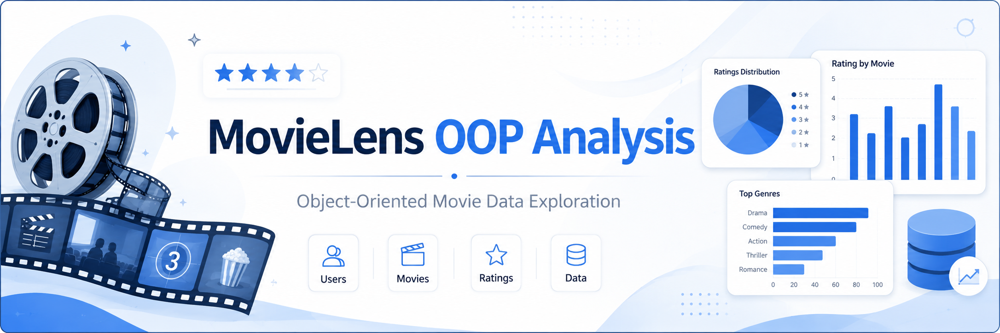
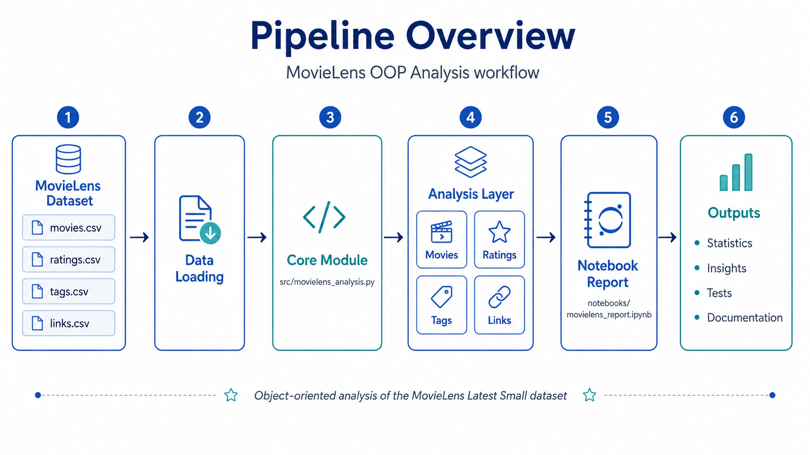
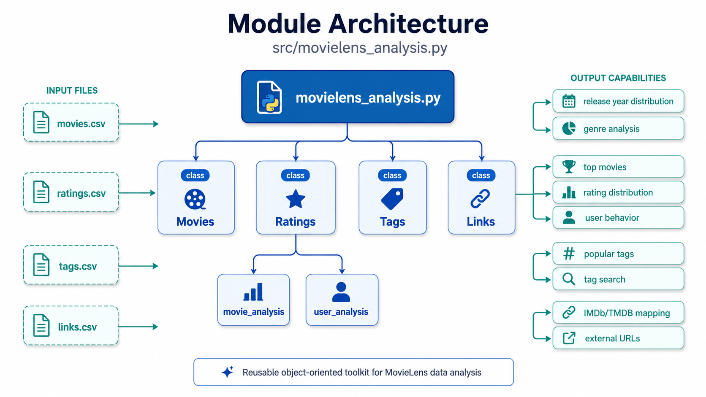

# MovieLens OOP Analysis



**Python 3.10+** · **Pytest** · **Object-Oriented Programming** · **Data Analysis** · **Portfolio Project**

## Overview

MovieLens OOP Analysis is a Python project for exploring and analyzing the MovieLens Latest Small dataset using an object-oriented programming approach.

The project provides reusable Python classes for analyzing movie metadata, user ratings, user-generated tags, and external movie identifiers. It also includes unit tests, documentation, visual diagrams, and a notebook-based analysis report.

This project was originally developed as part of a School 21 Russia programming assignment and later reorganized into a professional portfolio project.

## Table of Contents

- [Overview](#overview)
- [Project Objective](#project-objective)
- [Dataset](#dataset)
- [Pipeline Overview](#pipeline-overview)
- [Repository Structure](#repository-structure)
- [Main Features](#main-features)
- [Core Classes](#core-classes)
- [Module Architecture](#module-architecture)
- [How to Run](#how-to-run)
- [Running Tests](#running-tests)
- [Documentation](#documentation)
- [Skills Demonstrated](#skills-demonstrated)
- [Future Improvements](#future-improvements)
- [License](#license)
- [Dataset Citation](#dataset-citation)
- [Author](#author)

## Project Objective

The main goal of this project is to build a clean, reusable, and testable Python toolkit for analyzing MovieLens data.

The project focuses on:

- object-oriented programming;
- CSV data processing;
- movie metadata analysis;
- user rating analysis;
- tag analysis;
- external movie ID mapping;
- unit testing;
- technical documentation;
- reproducible notebook reporting.

## Dataset

The project uses the **MovieLens Latest Small** dataset provided by GroupLens Research.

Official source:

```text
https://grouplens.org/datasets/movielens/latest/
```

The dataset contains movie ratings and tagging activity from the MovieLens recommendation platform.

Required files:

```text
links.csv
movies.csv
ratings.csv
tags.csv
```

The CSV files are not included in this repository. They should be downloaded from the official GroupLens source and placed inside the `data/` directory.

Expected local structure:

```text
data/
├── links.csv
├── movies.csv
├── ratings.csv
└── tags.csv
```

More details are available in:

```text
data/README.md
docs/dataset_description.md
```

## Pipeline Overview

The project follows a simple and reproducible analysis workflow:



The general flow is:

```text
MovieLens CSV files
        ↓
Data loading
        ↓
Core Python module
        ↓
OOP analysis classes
        ↓
Notebook report
        ↓
Statistics, insights, tests, and documentation
```

## Repository Structure

```text
movielens-oop-analysis/
│
├── README.md
├── .gitignore
├── requirements.txt
├── LICENSE
│
├── assets/
│   ├── project_banner.png
│   ├── pipeline_diagram.png
│   └── module_architecture.png
│
├── src/
│   └── movielens_analysis.py
│
├── notebooks/
│   └── movielens_report.ipynb
│
├── data/
│   └── README.md
│
├── tests/
│   └── test_movielens_analysis.py
│
├── docs/
│   ├── project_overview.md
│   ├── dataset_description.md
│   └── module_reference.md
│
└── reports/
    └── analysis_summary.md
```

## Main Features

The project supports several types of analysis:

- movie release year distribution;
- genre distribution;
- movies with the largest number of genres;
- rating distribution by year;
- rating distribution by score;
- top movies by number of ratings;
- top movies by average or median rating;
- controversial movies based on rating variance;
- user-level rating behavior;
- popular tag analysis;
- longest tag detection;
- tag keyword search;
- IMDb and TMDB identifier mapping.

## Core Classes

The main module is located in:

```text
src/movielens_analysis.py
```

It contains four main classes:

```text
Movies
Ratings
Tags
Links
```

## Module Architecture

The architecture is centered around a reusable Python module that separates movie, rating, tag, and link analysis into dedicated classes.



### Movies

The `Movies` class analyzes `movies.csv`.

It can:

- extract release years from movie titles;
- count movies by release year;
- count movies by genre;
- find movies with the highest number of genres;
- search movie titles;
- retrieve movie titles and genres by `movieId`.

Example:

```python
from movielens_analysis import Movies

movies = Movies("data/movies.csv")

movies.dist_by_genres()
movies.most_genres(10)
movies.search_title("matrix")
```

### Ratings

The `Ratings` class analyzes `ratings.csv`.

It can perform movie-level and user-level analysis.

Example:

```python
from movielens_analysis import Ratings

ratings = Ratings(
    "data/ratings.csv",
    movies_path="data/movies.csv"
)

ratings.movie_analysis.top_by_num_of_ratings(10)
ratings.movie_analysis.top_by_ratings(10, metric="average")
ratings.movie_analysis.top_controversial(10)

ratings.user_analysis.dist_by_num_of_ratings()
ratings.user_analysis.top_controversial(10)
```

### Tags

The `Tags` class analyzes `tags.csv`.

It can:

- find the most popular tags;
- find the longest tags;
- find tags with the most words;
- search tags by word;
- retrieve tags by movie or user.

Example:

```python
from movielens_analysis import Tags

tags = Tags("data/tags.csv")

tags.most_popular(10)
tags.longest(10)
tags.tags_with("movie")
```

### Links

The `Links` class analyzes `links.csv`.

It can:

- map MovieLens IDs to IMDb IDs;
- map MovieLens IDs to TMDB IDs;
- generate IMDb URLs;
- generate TMDB URLs;
- join movie metadata with external links.

Example:

```python
from movielens_analysis import Links, Movies

links = Links("data/links.csv")
movies = Movies("data/movies.csv")

links.get_imdb_url(1)
links.get_tmdb_url(1)
links.join_with_movies(movies, 1)
```

## How to Run

### 1. Clone the repository

```bash
git clone https://github.com/Luis99fer/movielens-oop-analysis.git
cd movielens-oop-analysis
```

### 2. Create a virtual environment

Windows PowerShell:

```powershell
python -m venv .venv
.venv\Scripts\Activate.ps1
```

macOS/Linux:

```bash
python -m venv .venv
source .venv/bin/activate
```

### 3. Install dependencies

```bash
pip install -r requirements.txt
```

### 4. Download the dataset

Download the MovieLens Latest Small dataset from:

```text
https://grouplens.org/datasets/movielens/latest/
```

Download:

```text
ml-latest-small.zip
```

Extract the archive and copy these files into the `data/` directory:

```text
links.csv
movies.csv
ratings.csv
tags.csv
```

### 5. Run the notebook

Open:

```text
notebooks/movielens_report.ipynb
```

Or start Jupyter Notebook:

```bash
jupyter notebook
```

## Running Tests

Run all tests with:

```bash
python -m pytest tests -v
```

Expected result:

```text
All tests should pass successfully.
```

You can also check the main source file syntax with:

```bash
python -m py_compile src/movielens_analysis.py
```

## Documentation

Additional documentation is available in the `docs/` directory:

| File | Description |
|---|---|
| `docs/project_overview.md` | General explanation of the project. |
| `docs/dataset_description.md` | Dataset structure, files, and usage notes. |
| `docs/module_reference.md` | Reference guide for the main Python classes and methods. |
| `reports/analysis_summary.md` | Summary of analytical capabilities and expected insights. |

## Skills Demonstrated

This project demonstrates:

- Python programming;
- object-oriented programming;
- CSV parsing;
- data aggregation;
- statistical analysis;
- timestamp processing;
- regular expressions;
- unit testing with pytest;
- clean project organization;
- technical documentation;
- notebook-based reporting;
- GitHub portfolio preparation.

## License

This project is licensed under the MIT License.

The license applies to the code and documentation in this repository.

The MovieLens dataset is provided by GroupLens Research and should be downloaded from the official source.

## Dataset Citation

If you use the MovieLens dataset in research or publications, cite:

> F. Maxwell Harper and Joseph A. Konstan. 2015.  
> The MovieLens Datasets: History and Context.  
> ACM Transactions on Interactive Intelligent Systems, 5(4), Article 19.  
> https://doi.org/10.1145/2827872

## Author

**Luis Fernando Avalos Guzman**

GitHub: [Luis99fer](https://github.com/Luis99fer)